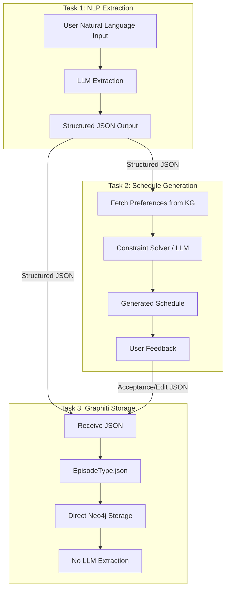
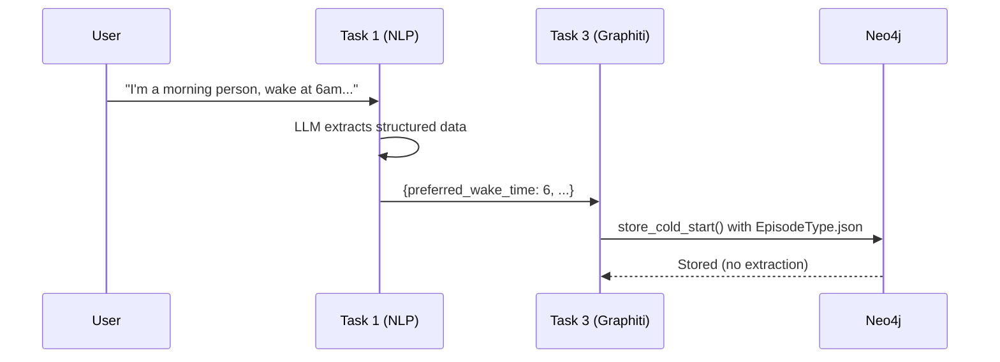
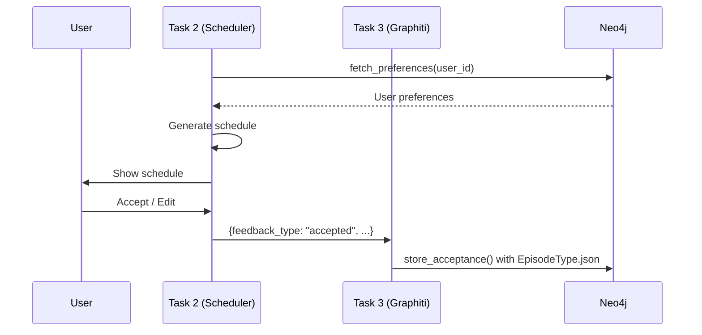
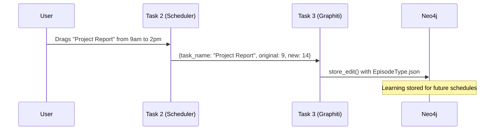

# Pulse KG Architecture
## Task 1 + Task 2 + Task 3 Integration

> **Post-Fix Architecture** - Solves the `CypherTypeError` (schema leakage) by having Task 1 produce structured JSON that Task 3 stores directly, bypassing Graphiti's internal LLM extraction.

---

## Architecture Overview



---

## The Problem We Solved

### Original Architecture (❌ Broken)
```
User Text → Task 1 → Natural Language → Task 3 (Graphiti) → LLM Extraction → Neo4j
                                                    ↓
                                            CypherTypeError!
                                            (Schema leakage: Map types in properties)
```

Graphiti's internal LLM was extracting entities with nested `Map` types that Neo4j doesn't support as node properties.

### New Architecture (✅ Working)
```
User Text → Task 1 → Structured JSON → Task 3 (Graphiti) → EpisodeType.json → Neo4j
                          ↓                                        ↓
                   All extraction done here              No LLM extraction!
                   (flat primitives only)                (direct storage)
```

---

## Task Responsibilities

### Task 1: NLP Extraction (LLM-Powered)

**Input:** Natural language from user  
**Output:** Fully structured JSON with flat, primitive values only  
**Responsibility:** ALL intelligence/extraction happens here

```python
# Example: User says "I wake up at 6am and prefer 45-minute focus blocks"
# Task 1 outputs:
{
    "preferred_wake_time": 6,        # int, not "6am"
    "preferred_sleep_time": 22,      # int
    "focus_block_minutes": 45,       # int
    "break_minutes": 10,             # int
    "productivity_style": "morning_person"  # string enum
}
```

> [!IMPORTANT]
> Task 1 must output **primitive types only** (str, int, float, bool, list of primitives).  
> No nested objects, no Maps, no complex types.

---

### Task 2: Schedule Generation

**Input:** 
- User preferences (from Graphiti via `fetch_preferences()`)
- Current tasks to schedule

**Output:** Generated schedule + user feedback

**Responsibility:** Constraint solving and schedule optimization

```python
# Fetch preferences from KG
from graphiti_client import fetch_preferences
prefs = await fetch_preferences(user_id)

# Generate schedule using prefs
schedule = generate_schedule(prefs, tasks)

# Capture user feedback
feedback = get_user_feedback(schedule)  # "accepted" or "edited"
```

---

### Task 3: Graphiti Storage (No LLM)

**Input:** Structured JSON from Task 1 or Task 2  
**Output:** Episode stored in Neo4j  
**Responsibility:** Direct storage only, NO extraction

```python
from graphiti_client import store_cold_start, store_acceptance, store_edit

# Store cold start preferences (from Task 1)
await store_cold_start(user_id, structured_json)

# Store acceptance feedback (from Task 2)
await store_acceptance(user_id, schedule_data)

# Store edit feedback (from Task 2)
await store_edit(user_id, edit_data)
```

**Key Implementation Detail:**
```python
# In store.py - uses EpisodeType.json to bypass LLM
await client.add_episode(
    name=episode_name,
    episode_body=json.dumps(data),  # JSON string
    source=EpisodeType.json,         # ← This is the fix!
    ...
)
```

---

## Data Flow Diagrams

### Flow 1: Cold Start (Onboarding)



### Flow 2: Schedule Generation + Feedback



### Flow 3: Edit Learning



---

## JSON Schemas for Integration

### Cold Start Input (Task 1 → Task 3)
```json
{
    "preferred_wake_time": 6,
    "preferred_sleep_time": 22,
    "productivity_style": "morning_person",
    "focus_block_minutes": 45,
    "break_minutes": 10,
    "tasks": [
        {"name": "Project Report", "priority": "high", "duration_minutes": 120},
        {"name": "Grocery Shopping", "priority": "low", "duration_minutes": 30}
    ]
}
```

### Acceptance Input (Task 2 → Task 3)
```json
{
    "schedule_id": "sched_123",
    "accepted_at": "2025-12-21T14:00:00",
    "blocks": [
        {"task": "Project Report", "start": 9, "end": 11},
        {"task": "Grocery Shopping", "start": 14, "end": 14.5}
    ]
}
```

### Edit Input (Task 2 → Task 3)
```json
{
    "task_name": "Project Report",
    "original_start_hour": 9,
    "new_start_hour": 14,
    "reason": "Had an unexpected meeting"
}
```

---

## Key Constraints

| Rule | Reason |
|------|--------|
| Task 1 outputs **primitives only** | Neo4j can't store Map types in properties |
| Task 3 uses `EpisodeType.json` | Bypasses Graphiti's LLM extraction |
| All JSON must be **flat** | Nested objects cause CypherTypeError |
| `group_id` = `user_id` | Multi-tenancy namespacing |

---

## Code Integration Points

```python
# From any Task 1 or Task 2 module:
from graphiti_client import (
    store_cold_start,    # Task 1 → Task 3
    store_acceptance,    # Task 2 → Task 3  
    store_edit,          # Task 2 → Task 3
    fetch_preferences,   # Task 3 → Task 2
)

# Example usage:
await store_cold_start("user_123", {
    "preferred_wake_time": 6,
    "productivity_style": "morning_person"
})
```

---

## LangGraph's Role (Optional Orchestration)

LangGraph **can** orchestrate these tasks but is currently **decoupled**:

- Task 1 and Task 2 can call `graphiti_client` functions directly
- LangGraph is available at `langgraph_flow.compile_graph()` for workflow orchestration if needed

The current architecture allows both:
1. **Direct function calls** (simpler, current approach)
2. **LangGraph orchestration** (for complex multi-step flows)
