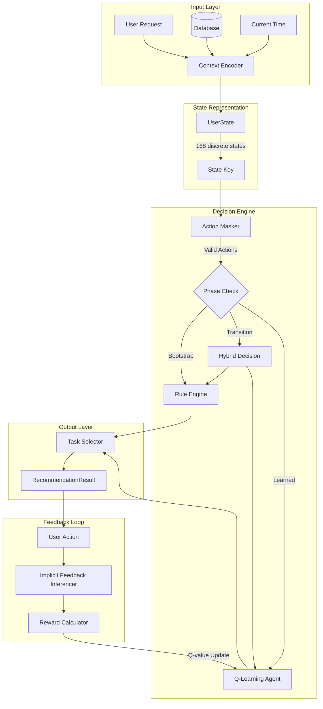
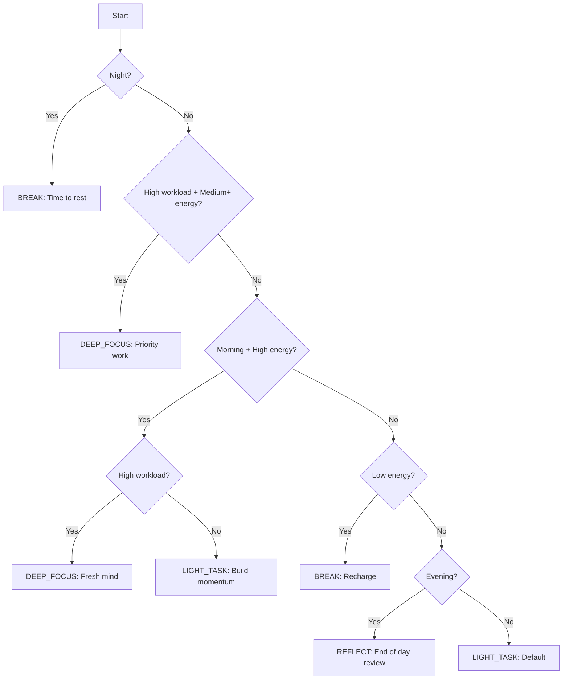
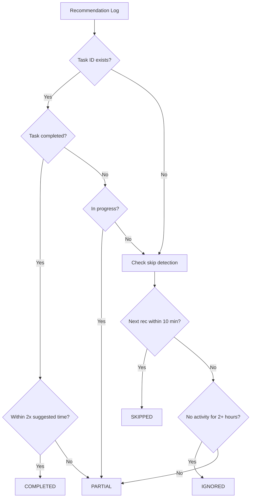
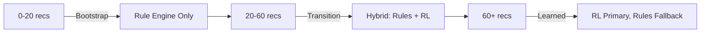
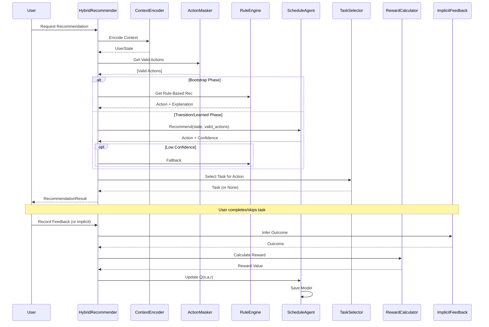

# PULSE 2.0 AI Module Technical Report

## Executive Summary

The PULSE 2.0 AI module is a sophisticated **Q-Learning based task recommendation system** designed to provide personalized productivity recommendations. It combines classical reinforcement learning techniques with rule-based heuristics in a hybrid architecture, enabling both intelligent learning from user behavior and reliable fallback recommendations during cold-start scenarios.

---

## System Architecture



---

## Core Components

### 1. State Representation (`state.py`)

The state space is designed to capture the essential context for productivity recommendations while remaining computationally tractable.

#### State Space Design

| Dimension | Values | Count |
|-----------|--------|-------|
| **Time Block** | morning, afternoon, evening, night | 4 |
| **Day of Week** | monday - sunday | 7 |
| **Energy Level** | low, medium, high | 3 |
| **Workload Pressure** | low, high | 2 |

**Total State Space: 4 × 7 × 3 × 2 = 168 discrete states**

#### Design Rationale

- **Temporal Awareness**: Time blocks align with circadian rhythm patterns (morning freshness, afternoon slump, evening wind-down)
- **Energy Modeling**: Three-level discretization balances granularity with learnability
- **Workload Binary**: Simplified high/low distinction reduces state explosion while capturing urgency
- **State Serialization**: Pipe-separated string keys (`"morning|monday|high|low"`) ensure JSON compatibility for persistence

---

### 2. Action Space (`actions.py`)

The system defines **5 action types** representing different productivity modes:

| Action | Cognitive Load | Suggested Duration | Constraints |
|--------|---------------|-------------------|-------------|
| **DEEP_FOCUS** | High | 90 min | Morning/Afternoon only, requires medium+ energy |
| **LIGHT_TASK** | Low | 30 min | Most time blocks, any energy |
| **BREAK** | None | 15 min | Always valid |
| **EXERCISE** | None | 20 min | Morning/Evening only |
| **REFLECT** | Medium | 10 min | Best in morning/evening |

#### Design Philosophy

- **Cognitive Load Alignment**: Actions are matched to energy levels to prevent burnout
- **Temporal Constraints**: Certain actions are restricted by time of day (e.g., no deep focus at night)
- **Holistic Productivity**: Includes wellness activities (breaks, exercise, reflection) alongside work tasks

---

### 3. Context Encoder (`context_encoder.py`)

Transforms raw user data and current time into a discrete `UserState` for the Q-Learning agent.

#### Feature Extraction Logic

**Time Block Mapping:**
```
06:00 - 12:00 → morning
12:00 - 18:00 → afternoon
18:00 - 22:00 → evening
22:00 - 06:00 → night
```

**Energy Level Calculation:**
1. Base: Latest mood score (1-10 scale)
2. Modifiers:
   - Morning + few tasks completed → +1 (circadian boost)
   - 5+ tasks completed today → -1 (fatigue)
   - Evening → -1 (natural decline)
   - Night → -2 (severe decline)
3. Discretization: ≥8 = high, ≥5 = medium, <5 = low

**Workload Pressure:**
- High if any priority ≥4 tasks pending
- High if any deadline within 24 hours
- Otherwise: Low

---

### 4. Q-Learning Agent (`agent.py`)

The core reinforcement learning component implementing tabular Q-Learning.

#### Algorithm: Q-Learning Update Rule

$$Q(s, a) \leftarrow Q(s, a) + \alpha \cdot (r - Q(s, a))$$

Where:
- **s**: Current state
- **a**: Action taken
- **α**: Learning rate (adaptive)
- **r**: Observed reward

#### Key Features

| Feature | Implementation |
|---------|---------------|
| **Exploration Strategy** | ε-greedy with linear decay |
| **Initial ε** | 0.25 (25% random exploration) |
| **Minimum ε** | 0.05 (5% maintained exploration) |
| **Decay Start** | After 60 recommendations |
| **Optimistic Initialization** | Q-values start at 0.5 (encourages exploration) |
| **Adaptive Learning Rate** | Higher for less-visited state-action pairs |

#### Learning Rate Schedule

| Visit Count | Learning Rate (α) |
|-------------|------------------|
| < 5 visits | 0.30 (aggressive learning) |
| 5-19 visits | 0.10 (moderate learning) |
| ≥ 20 visits | 0.05 (conservative updates) |

#### Thread Safety & Persistence

- **Singleton Pattern**: One agent instance per user
- **Thread-Safe Access**: Locking mechanisms for concurrent requests
- **Atomic Persistence**: Uses `.tmp` + `os.replace()` to prevent corruption
- **Model Storage**: JSON Q-tables stored in `data/user_models/`

---

### 5. Rule Engine (`rule_engine.py`)

Heuristic-based recommendation system for cold-start and fallback scenarios.

#### Rule Priority Chain



#### Rule Rationale

- **Safety First**: Night always suggests break (prevents overwork)
- **Energy Respect**: Low energy → break, never high-cognitive tasks
- **Circadian Optimization**: Morning favors complex work, evening favors reflection
- **Workload Responsiveness**: High-priority work gets priority when energy permits

---

### 6. Action Masker (`action_masker.py`)

Filters invalid actions based on context constraints before passing to the agent.

#### Masking Rules

| Rule | Condition | Effect |
|------|-----------|--------|
| **Night Rule** | time_block = "night" | Only BREAK allowed |
| **Low Energy Rule** | energy_level = "low" | DEEP_FOCUS blocked |
| **Exercise Timing** | time_block ∉ {morning, evening} | EXERCISE blocked |
| **No Tasks Available** | No pending tasks in DB | DEEP_FOCUS, LIGHT_TASK blocked |
| **Low Priority Only** | No high-priority tasks | DEEP_FOCUS deprioritized |

#### Action Scoring Algorithm

Each valid action receives a contextual appropriateness score:

```
score = 1.0 (base)
+ 1.0 if action valid for time block
+ 0.5 if energy ≥ required minimum
+ 0.5 if workload matches action requirements
- 1.5 if high cognitive load + low energy
- 0.3 if no cognitive load + high energy (wasted potential)
```

---

### 7. Reward Calculator (`reward_calculator.py`)

Computes calibrated rewards for Q-Learning updates based on user outcomes.

#### Reward Components

| Component | Range | Description |
|-----------|-------|-------------|
| **Base Outcome** | -0.5 to +1.0 | Completed (+1.0), Partial (+0.3), Skipped (-0.5), Ignored (-0.2) |
| **Mood Change** | -0.3 to +0.2 | Improved (+0.2), Declined (-0.3), Same (0) |
| **Time Bonus** | 0 to +0.2 | If completed within 120% of suggested duration |
| **Rating Bonus** | 0 to +0.5 | 4-5 stars (+0.5), 3 stars (+0.1) |

**Final Reward Range: [-0.8, 2.0]**

#### Recency Decay

Historical interactions are weighted: `weight = 0.95^days_old`

This ensures recent feedback has stronger influence while still learning from history.

---

### 8. Implicit Feedback Inferencer (`implicit_feedback.py`)

Deduces user outcomes from behavior patterns without requiring explicit feedback.

#### Inference Logic



#### Detection Thresholds

| Behavior | Threshold | Inferred Outcome |
|----------|-----------|------------------|
| Quick next recommendation | < 10 minutes | SKIPPED |
| No activity, no completion | ≥ 2 hours | IGNORED |
| Task marked complete | - | COMPLETED or PARTIAL |

---

### 9. Mood Mapper (`mood_mapper.py`)

Translates string mood descriptors into numeric energy scores.

#### Mood Score Scale (1-10)

| Category | Moods | Score Range |
|----------|-------|-------------|
| **High Energy** | energized, excited | 9 |
| | focused, happy | 8 |
| **Medium Energy** | content | 7 |
| | calm | 6 |
| | neutral, okay | 5 |
| **Low Energy** | stressed, anxious | 4 |
| | tired | 3 |
| | sad | 2 |
| | overwhelmed, exhausted | 1-2 |

---

### 10. Task Selector (`task_selector.py`)

Maps abstract action recommendations to concrete tasks from the database.

#### Task-Action Mapping

| Action | Priority Filter | Duration Cap | Deadline Priority |
|--------|----------------|--------------|-------------------|
| **DEEP_FOCUS** | ≥ 3 | 120 min | Yes |
| **LIGHT_TASK** | ≤ 3 | 45 min | No |

#### Task Scoring Factors

1. **Deadline Proximity**:
   - Overdue: +5 points
   - Within 4 hours: +4 points
   - Today: +3 points
   - Within 3 days: +2 points
   - Has deadline: +1 point

2. **Priority**: +1 to +5 points (direct mapping)

3. **Duration Match**: +1 if within 50-150% of suggested duration

4. **Age Bonus**: +0.1 per day (max +1), prevents task starvation

---

### 11. Hybrid Recommender (`hybrid_recommender.py`)

Main orchestrator that combines all components into a cohesive recommendation pipeline.

#### Phase-Based Strategy



| Phase | Recommendation Count | Strategy |
|-------|---------------------|----------|
| **Bootstrap** | < 20 | 100% Rule Engine |
| **Transition** | 20-59 | Hybrid: RL if confident, else rules |
| **Learned** | ≥ 60 | RL primary, rules only if low confidence |

#### Confidence Thresholds

| Phase | Minimum Confidence for RL |
|-------|---------------------------|
| Transition | 0.5 (50%) |
| Learned | 0.7 (70%) |

---

### 12. Configuration (`config.py`)

Centralized settings for tuning the AI system.

#### Key Configuration Parameters

| Parameter | Default | Purpose |
|-----------|---------|---------|
| `SINGLE_USER_MODE` | True | Simplified single-user operation |
| `INITIAL_EPSILON` | 0.25 | Starting exploration rate |
| `MIN_EPSILON` | 0.05 | Minimum exploration maintained |
| `BOOTSTRAP_THRESHOLD` | 20 | Recommendations before RL kicks in |
| `TRANSITION_THRESHOLD` | 60 | Recommendations before RL dominance |
| `PERSIST_INTERVAL_SECONDS` | 300 | Model save frequency (5 min) |

---

## Theoretical Foundations

### Why Q-Learning?

**Q-Learning** was chosen for several key reasons:

1. **Model-Free**: No need to model the environment dynamics—learns directly from experience
2. **Off-Policy**: Can learn from historical data and exploratory actions
3. **Tabular Tractability**: With only 168 states × 5 actions = 840 Q-values, tabular methods are efficient
4. **Interpretability**: Q-values provide clear preference rankings for debugging

### Exploration vs. Exploitation Trade-off

The ε-greedy policy with decay balances:
- **Early Exploration** (ε = 0.25): Discover what works for each user
- **Late Exploitation** (ε → 0.05): Rely on learned preferences while maintaining adaptability

### Cold Start Problem Solution

The three-phase approach (Bootstrap → Transition → Learned) addresses cold start:
- New users get sensible rule-based recommendations immediately
- As data accumulates, RL gradually takes over
- Fallback to rules ensures no "bad" recommendations even with sparse data

### Implicit Learning

Unlike systems requiring explicit ratings, PULSE infers outcomes from behavior:
- Task completion timing
- Skip patterns
- Activity gaps

This reduces user friction while maintaining learning signal quality.

---

## Data Flow Summary



---

## Key Design Decisions

| Decision | Rationale |
|----------|-----------|
| **168-state discretization** | Balances expressiveness with learning speed; avoids curse of dimensionality |
| **5 action types** | Covers core productivity modes without overwhelming complexity |
| **Optimistic Q-initialization** | Encourages exploration of all state-action pairs |
| **Adaptive learning rate** | Allows rapid learning initially, stability as confidence grows |
| **Three-phase rollout** | Ensures good UX from day one while building toward personalization |
| **Implicit feedback** | Reduces friction, captures real behavior, not just stated preferences |
| **Action masking** | Prevents absurd recommendations (e.g., deep focus at 2 AM) |
| **Per-user model storage** | Enables true personalization, easy export/migration |

---

## Future Enhancement Opportunities

1. **Contextual Bandits**: For faster learning in specific contexts
2. **Neural Function Approximation**: Handle richer state representations
3. **Multi-Task Learning**: Share learning across users with similar patterns
4. **Temporal Credit Assignment**: Better handle delayed outcomes
5. **Proactive Recommendations**: Push notifications at optimal times
6. **A/B Testing Framework**: Systematic comparison of policy variants

---

## Conclusion

The PULSE 2.0 AI module represents a thoughtfully designed reinforcement learning system for productivity coaching. By combining the adaptability of Q-Learning with the reliability of rule-based heuristics, it delivers personalized recommendations that improve over time while maintaining sensible defaults for new users. The modular architecture ensures maintainability, testability, and future extensibility.
